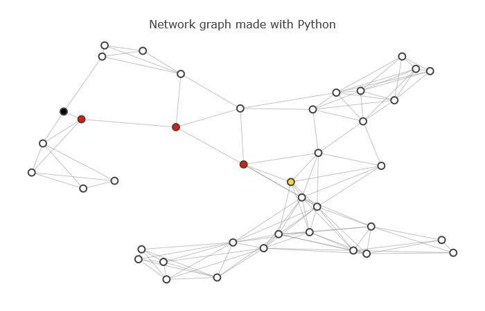

# route_planner

## Motivation
I did this project as part of Udacity, Data Structure and Algorithms Nanodegree that I took to ensure that my code is written efficiently. 
This is especially important for solutions that needs to be scaled. Or solutions with limited computing power. As robots.

## Project description


The goal of the project was to build a route-planning algorithm like the one used in Google Maps to calculate the shortest path between two points on a map. For sure, the one used in Google Maps is much more optimized.
To achive this, I have implemented A* search with euclidean distance heuristics.

The original heuristic calculation was:
```
distance = math.sqrt(((x1-x2)**2) + (y1-y2)**2) 
```

However, the following heuristics calculation works well too and is much faster as it has no square root calculations. (thank the @Reviewer for the tip!)
```
abs(x1 - x2) + abs(y1 - y2)
```

## Usage
- 1. Run `route_planner.ipynb`
- 2. Experiment with route-planning algorithm code in 

## Libraries used
Python 3
- math
- queue

## Files in the repository
- `route_planner.ipynb`: contains the main jupyter notebook for the route planning algorithm execution
- `my_algorithm`: contains implemented algorithm to find the shortest path in the map
- `helpers.py`: contains auxiliary functions
- `map-10.pickle`: constains the map definition with 10 nodes 
- `map-40.pickle`: constains the map definition with 40 nodes  
- `test.py`: contains the testing code 
